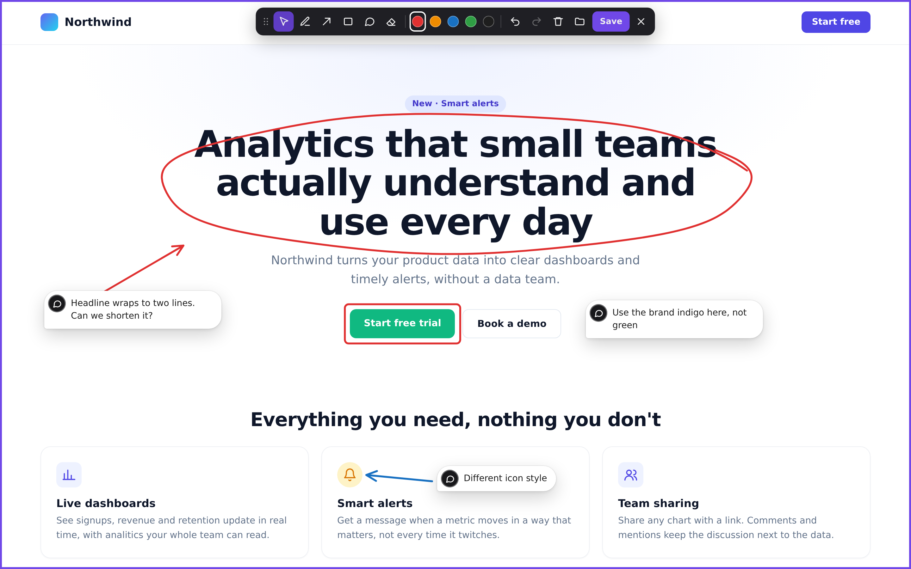
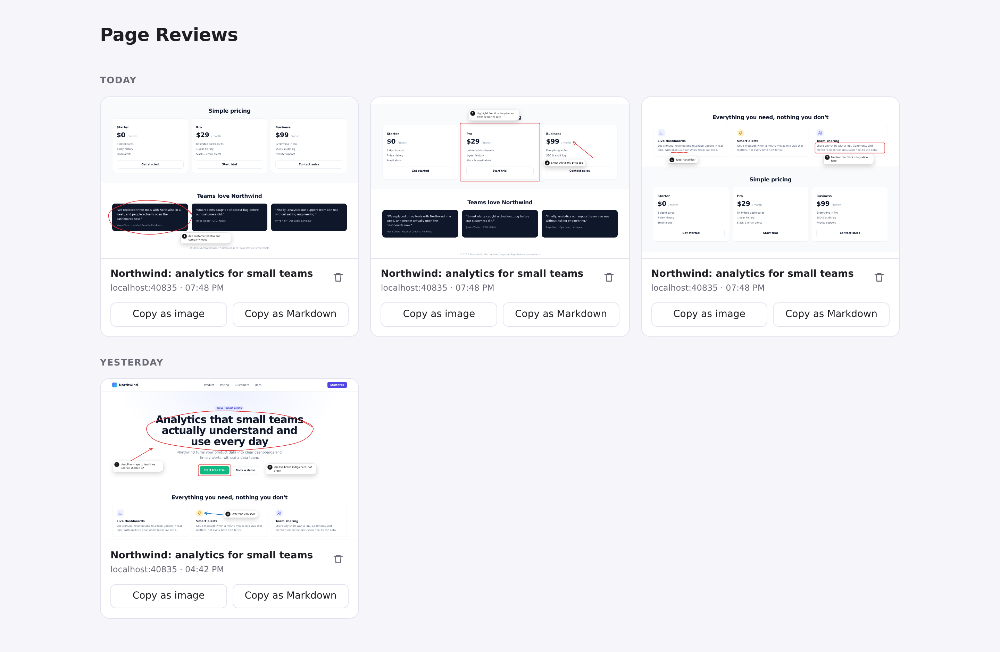

# Page Review

> [!WARNING]
> **Beta.** This is an early prototype and is not recommended for regular use yet.
> Expect rough edges and breaking changes, including to saved reviews.

A Chrome extension for reviewing websites the way you'd mark up a screenshot:
draw arrows, boxes and freehand marks right on top of any page and leave
Figma-style comments. Each review is saved as an annotated screenshot plus a
structured description of every comment and the page element it points at, ready
to paste into an AI agent or a ticket.

Everything stays in your browser.



## Install

1. Clone this repo.
2. Open `chrome://extensions` and turn on **Developer mode** (top right).
3. Click **Load unpacked** and select the `extension/` folder.
4. Pin **Page Review** from the puzzle-piece menu in the toolbar.

## Use

Open any page, click the Page Review icon (or press **Alt+Shift+R**), mark it up and
press **Ctrl/Cmd+S**. Saved reviews are on the reviews page: the folder button in
the toolbar, or right-click the icon → *Open saved reviews*.

| Action | How |
| --- | --- |
| Start / stop reviewing | Click the icon or **Alt+Shift+R** |
| Tools | **V** select/move · **P** pen · **A** arrow · **R** box · **T** comment · **E** eraser |
| Colors | **1–5** (also recolors the selected drawing) |
| Move | Select tool → drag. Comments can be dragged with any tool. Arrow keys nudge (Shift = 10px) |
| Delete | Select → **Delete**/Backspace, or the eraser |
| Edit a comment | Double-click it |
| Undo / redo | **Ctrl/Cmd+Z** · **Ctrl/Cmd+Shift+Z** or **Ctrl+Y** (any keyboard layout) |
| Save | **Ctrl/Cmd+S** |
| Exit | **Esc** (the first Esc deselects) |

The page can't scroll while review mode is on, because drawings belong to the
current viewport.

### Reviews page

Reviews are grouped by day (Today, Yesterday, …). Each card has:

- **Copy as image**: the annotated screenshot. Comment pins and badges show numbers.
- **Copy as Markdown**: every comment with its target element (CSS selector, text,
  position, computed styles, HTML snippet), numbered to match the screenshot.
  Paste both into an AI agent and ask it to fix the page.

Click a screenshot to see it full size.



Each comment in the Markdown looks like this (from the review above):

````markdown
### 1

> Headline wraps to two lines. Can we shorten it?

- **Annotation:** Freehand mark over/around the target element (drawn as pen + arrow)
- **Target selector:** `h1`
- **Target text:** "Analytics that small teams actually understand and use every day"
- **Target box:** x=280, y=198, 880×184
- **Ancestors (nearest first):** `header.hero` < `body`
- **Computed styles:** color: rgb(15, 23, 42); font-size: 58px; font-weight: 700; line-height: 61.48px; …

```html
<h1>Analytics that small teams actually understand and use every day</h1>
```
````

### How comments find their element

- **Comment on its own**: the element under the comment's pin (the card's sharp corner).
- **Arrow**: the element under the arrow tip, or something just past it if the
  arrow stops a little short. A comment near the arrow's tail becomes its text.
- **Box or freehand circle**: the element that best matches the drawn area.
- **Underline**: the text just above it.
- A comment belongs to the mark you drew right before it, or else to the nearest mark.
- **Marks that touch** (a circle plus an underline, an arrow pointing into a circle)
  count as one comment.

After each mark, a dashed outline briefly shows which element it picked.

## Develop

```bash
npm install
npm test          # headless Chromium: loads the extension, draws, saves, checks the reviews page
npm run icons     # regenerate extension/icons/
npm run screenshots  # regenerate docs/screenshots/ from the demo page in docs/demo/
```

After changing the code, click ↻ on the extension in `chrome://extensions` and
refresh the page you're reviewing.

## Limitations

- Captures the visible part of the page only (no full-page reviews yet).
- Saved reviews can't be reopened for editing.
- Content inside iframes isn't detected.
- Doesn't run on `chrome://` pages, the Chrome Web Store or the PDF viewer.
